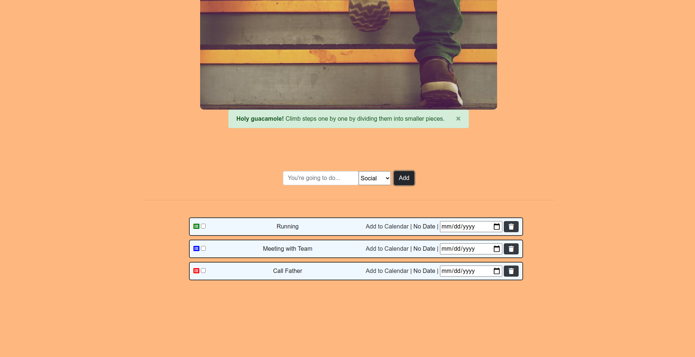

# Todo list Application

## About 

Todo list application helps you to track your tasks in order to accomplish them without memorizing them. 

## Setting the Task
You can set your task's details easily such as name, category and due date of the task. There are three category tags called Sport, Business and Social which helps you to distinguish your tasks easily. Each task category is displayed on the left side relative to the each task element with different categories.

- Green: Sport
- Blue: Business
- Red: Social

## Are tasks stored permanently?

Yes, the tasks are in this application stored within local storage on the browser. Therefore, you can see your tasks after assigning until removing them.